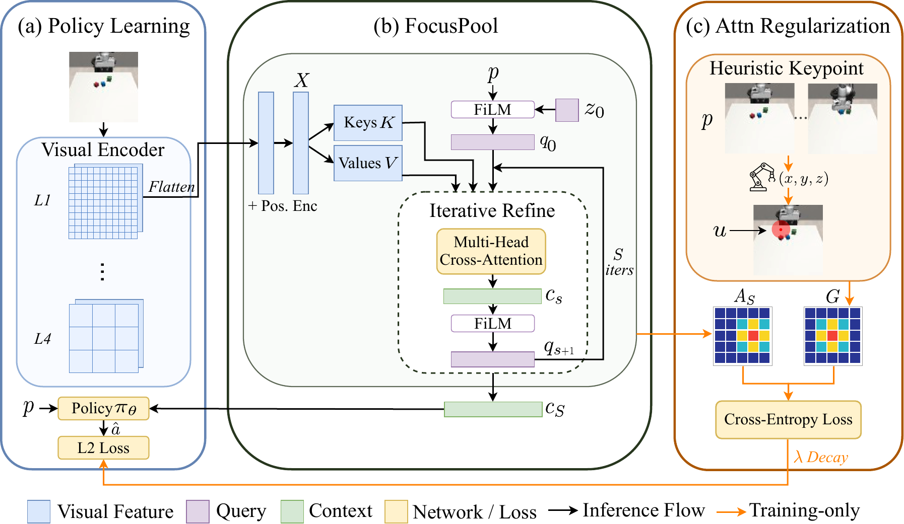
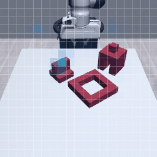
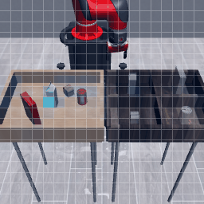
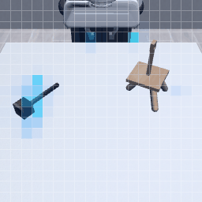
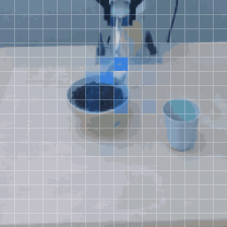
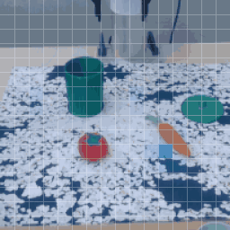

# FocusPool

Official code release for FocusPool.

<table>
  <tr>
    <td rowspan="2" width="48%" align="center">
      <a href="media/method.pdf">
        
      </a>
    </td>
    <td rowspan="2" width="4%" align="center"><strong>-&gt;</strong></td>
    <td width="16%" align="center">
      
    </td>
    <td width="16%" align="center">
      
    </td>
    <td width="16%" align="center">
      
    </td>
  </tr>

  <tr>
    <td width="16%" align="center">
      
    </td>
    <td width="16%" align="center">
      
    </td>
    <td width="16%" align="center">
      
    </td>
  </tr>
</table>

## Repository Core

```text
focuspool/config/        Hydra configs for policy training
focuspool/dataset/       LMDB/NPZ cache loading, oracle labels, action conversion
focuspool/model/         stage-pooled ResNet, RVT2Heatmap, diffusion modules
```

Default local paths:

```text
datasets/mimicgen/<task>/<task>.hdf5       raw MimicGen dataset
datasets/mimicgen/<task>/<task>_lmdb       rerendered cache
.weights/                                  optional RVT2/DINO checkpoints
```

## Install

Install system rendering packages first:

```bash
sudo apt update
sudo apt install -y libosmesa6-dev libgl1-mesa-glx libglfw3 patchelf
```

If `sudo` is unavailable, use the conda fallback after creating the env:

```bash
mamba install -c conda-forge glew mesalib
mamba install -c menpo glfw3
```

Create and activate the conda environment:

```bash
mamba env create -f conda_environment.yaml
conda activate focuspool
```

Install the pinned robosuite/robomimic/MimicGen stack:

```bash
bash focuspool/scripts/setup_suite_deps.sh ../focuspool-suite-deps
```

The suite setup script reads `.dep/mimicgen.lock`, checks out exact upstream
commits, applies the patches in `.dep/`, and installs those checkouts editable
into the active conda environment.


## Data

Download a MimicGen task:

```bash
TASK=square_d2
mkdir -p datasets/mimicgen/${TASK}
wget -O datasets/mimicgen/${TASK}/${TASK}.hdf5 \
  "https://huggingface.co/datasets/amandlek/mimicgen_datasets/resolve/main/core/${TASK}.hdf5?download=true"
```

Rerender one task into the cache format used by training:

```bash
focuspool rerender-dataset \
  --dataset datasets/mimicgen/square_d2/square_d2.hdf5 \
  --n-demo 100 \
  --overwrite
```

Rerender several tasks under one root:

```bash
focuspool rerender-dataset \
  --datasets-root datasets/mimicgen \
  --tasks square_d2 stack_three_d1 threading_d2 coffee_preparation_d1 \
  --n-demo 100 \
  --overwrite
```

Merge per-task caches for multitask RVT-2 Heatmap training:

```bash
focuspool merge-datasets \
  --datasets-root datasets/mimicgen \
  --tasks square_d2 stack_three_d1 threading_d2 coffee_preparation_d1 \
  --output-task mimicgen_multitask \
  --n-demo-per-task 100 \
  --overwrite
```

## Training

Train FocusPool policy:

```bash
focuspool train \
  --config-name=train_stage_pooled_policy \
  task_name=square_d2 \
  n_demo=100 \
  pooling=focus_refine \
  pooling_stage=l2
```

`train_stage_pooled_policy` uses `TrainFocusPolicyWorkspace`,
`DiffusionPolicy`, and `StagePooledObsEncoder`. The default method is
`focus_refine` at `l2` with the soft attention prior enabled. The prior is
automatically disabled for non-differentiable pooling modes.

Train average-pooling or spatial-softmax baseline:

```bash
focuspool train \
  --config-name=train_stage_pooled_policy \
  task_name=square_d2 \
  n_demo=100 \
  pooling=average_pool or spatial_softmax\
  pooling_stage=l2 \
  attn_prior=false
```

## RVT-2 Baseline

RVT-2 baseline requires a two-stage training workflow. Firtst, train the Heatmap prediction model on a merged multitask cache:

```bash
focuspool train \
  --config-name=train_rvt2_heatmap \
  task_name=mimicgen_multitask \
  dataset_demo_count_mode=per_task \
  n_demo=100
```

Then, train a policy that uses RVT-2 Heatmap crops:

```bash
focuspool train \
  --config-name=train_rvt2_policy \
  task_name=square_d2 \
  n_demo=100 \
  rvt2_obs_encoder.focus_view_transform.rvt2_heatmap.checkpoint=.weights/mimicgen.rvt2_heatmap.ckpt
```

A pretrained DINOv3 chekpoint `dinov3_vits16plus.pth` under `.weights/` is required for RVT-2 heatmap training. Configure the path in `focuspool/config/visual_focus_default_params.yaml`.

## Evaluation

Evaluate one checkpoint:

```bash
focuspool eval \
  --checkpoint experiments/square_d2/focus_refine/test_no_pretrain/checkpoints/latest.ckpt \
  --n-envs 25 \
  --n-eval-rollouts 50 \
  --output-dir results/square_d2/focus_refine
```

Evaluate every checkpoint in a directory:

```bash
focuspool eval \
  --checkpoint experiments/square_d2/focus_refine/test_no_pretrain/checkpoints \
  --n-envs 25 \
  --n-eval-rollouts 50
```

## CLI

```bash
focuspool <command> --help
```

Commands:

```text
train
eval
rerender-dataset
playback-dataset
merge-datasets
setup-assets
```

## Acknowledgements

This repo builds on:

- Diffusion Policy: https://github.com/real-stanford/diffusion_policy
- robosuite: https://github.com/ARISE-Initiative/robosuite
- robomimic: https://github.com/ARISE-Initiative/robomimic
- MimicGen: https://github.com/NVlabs/mimicgen
- DINOv3: https://github.com/facebookresearch/dinov3

Vendored DINOv3 code lives in `focuspool/model/dinov3_core/` and is used only by
the optional RVT-2 Heatmap DINO backbone.

## License

MIT. See `LICENSE`.
